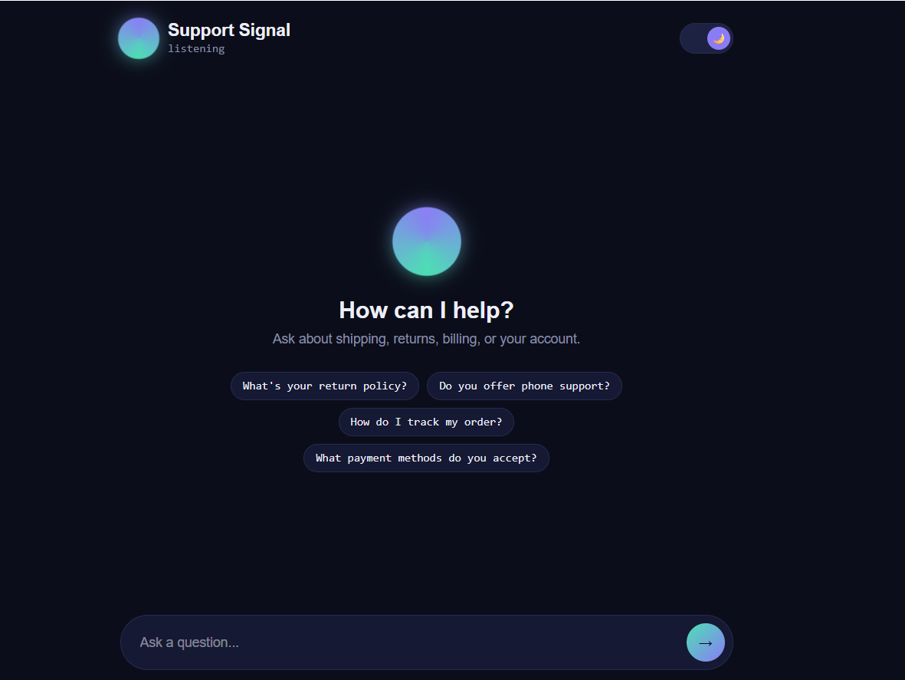

# Support Signal — AI Customer Support Agent

An AI-powered customer support chatbot that answers questions instantly using
Retrieval-Augmented Generation (RAG), escalates unresolved issues to human
agents, remembers conversation history, and supports multiple languages —
built entirely on free-tier infrastructure.

**Live demo:** [your-vercel-url-here]



## Features

- **Trained on your documentation** — answers are grounded in your own
  markdown docs (shipping, returns, billing, warranty, privacy, etc.), not
  generic AI guesses
- **Instant answers** — streaming responses via the Vercel AI SDK, no page
  reloads
- **Chat history** — every conversation is persisted to Supabase
- **Escalation to humans** — automatically detects when the agent can't
  resolve a query and flags it for human review, with a visible in-chat
  notice
- **Multi-language support** — responds in whatever language the user writes
  in
- **Hybrid knowledge mode** — general conversation is answered freely, but
  policy-specific facts (prices, deadlines, procedures) are strictly
  grounded in documentation to avoid hallucinated policy details
- **Custom animated UI** — dark/light theme, an animated "Signal Orb" that
  visually reflects the agent's state (idle, thinking, responding,
  escalated), built with React and Framer Motion

## Tech stack

| Layer | Technology |
|---|---|
| Framework | Next.js 16 (App Router) |
| Chat UI / streaming | Vercel AI SDK (`ai`, `@ai-sdk/react`) |
| LLM + embeddings | Google Gemini (`gemini-3.5-flash`, `gemini-embedding-001`) via `@ai-sdk/google` and `@langchain/google-genai` |
| RAG orchestration | LangChain (`langchain`, `@langchain/community`, `@langchain/core`, `@langchain/textsplitters`) |
| Database + vector store | Supabase (Postgres + pgvector) |
| Styling / animation | Tailwind CSS v4, Framer Motion, custom CSS |
| Deployment | Vercel |

## How it works

1. **Ingestion** (`scripts/ingest.ts`): markdown files in `docs/` are split
   into chunks, embedded via Gemini, and stored in Supabase's `documents`
   table (pgvector column) alongside their source metadata.
2. **User sends a message** in the chat UI (`app/page.tsx`).
3. **API route** (`app/api/chat/route.ts`):
   - Embeds the user's question
   - Runs a similarity search against `documents` via the `match_documents`
     Postgres function
   - Builds a system prompt combining the retrieved context with
     instructions on when to answer freely vs. stay strictly doc-grounded
   - Streams a response from Gemini back to the client
   - Saves both the user's message and the agent's reply to the
     `conversations` / `messages` tables
   - Checks the reply for escalation-trigger phrases and logs to the
     `escalations` table if needed
4. **Frontend** polls a small `/api/check-escalation` route after each reply
   to show a live escalation banner if needed.

## Project structure
    app/
        page.tsx # Chat UI
        layout.tsx # Root layout, metadata
        globals.css # Theme tokens, animations, Tailwind import
        api/
            chat/route.ts # Main RAG + streaming chat endpoint
            check-escalation/route.ts # Polls escalation status for a conversation
    docs/ # Knowledge base source files (markdown)
    scripts/
        ingest.ts # Embeds docs/*.md into Supabase

## Database schema (Supabase)

- **`documents`** — `id`, `content`, `metadata` (jsonb), `embedding`
  (vector) — the knowledge base
- **`conversations`** — `id`, `user_id`, `language`, `created_at`
- **`messages`** — `id`, `conversation_id`, `role`, `content`, `created_at`
- **`escalations`** — `id`, `conversation_id`, `reason`, `status`,
  `created_at`
- **`match_documents`** — Postgres function used for pgvector similarity
  search

Row Level Security (RLS) is enabled on all tables; all writes happen
server-side using the Supabase service role key, which bypasses RLS by
design — the public/anon key is never used for direct table access.

## Getting started locally

### 1. Clone and install

```bash
git clone https://github.com/mohamedbadishajji/ai-support-agent.git
cd ai-support-agent
npm install --legacy-peer-deps
```

> `--legacy-peer-deps` is required due to a peer dependency conflict between
> `@langchain/community` and an optional browser-automation dependency it
> bundles (unused in this project). A `.npmrc` file in this repo already
> sets this automatically.

### 2. Set up Supabase

1. Create a project at [supabase.com](https://supabase.com)
2. In the SQL Editor, run the schema in [`supabase/schema.sql`](#) (enable
   the `vector` extension, create `documents`, `conversations`, `messages`,
   `escalations`, and the `match_documents` function)
3. Copy your Project URL and API keys from Project Settings → API Keys

### 3. Get a free Gemini API key

Go to [aistudio.google.com/apikey](https://aistudio.google.com/apikey) and
create a key — no billing required for the free tier.

### 4. Environment variables

Create `.env.local` in the project root:
    NEXT_PUBLIC_SUPABASE_URL=your_supabase_url
    NEXT_PUBLIC_SUPABASE_ANON_KEY=your_supabase_publishable_key
    SUPABASE_SERVICE_ROLE_KEY=your_supabase_secret_key
    GOOGLE_API_KEY=your_gemini_api_key
    GOOGLE_GENERATIVE_AI_API_KEY=your_gemini_api_key

### 5. Add your documentation

Drop markdown files into `docs/` — one topic per file works best for
retrieval quality.

### 6. Ingest your docs into Supabase

```bash
npm run ingest
```

### 7. Run the dev server

```bash
npm run dev
```

Open [http://localhost:3000](http://localhost:3000).

> **Note:** this project runs with `next dev --webpack` rather than the
> Turbopack default, due to a CSS parsing bug encountered with Turbopack's
> dev filesystem cache in Next.js 16. Feel free to try removing `--webpack`
> as Turbopack matures.

## Deployment

Deployed on Vercel, connected to this GitHub repo for automatic deploys on
push to `main`. Environment variables must be added in the Vercel project
settings (same keys as `.env.local` above) before the first deploy.

## Known limitations

- Escalation detection is keyword-based (checks the agent's response for
  phrases like "don't know" / "escalate"), not a separate classification
  model — simple and transparent, but not perfectly precise
- No authentication — conversation IDs are generated per browser session
  and not tied to a real user account
- No admin dashboard yet for reviewing/resolving escalated conversations
  (currently viewable directly in the Supabase table editor)

## License

MIT